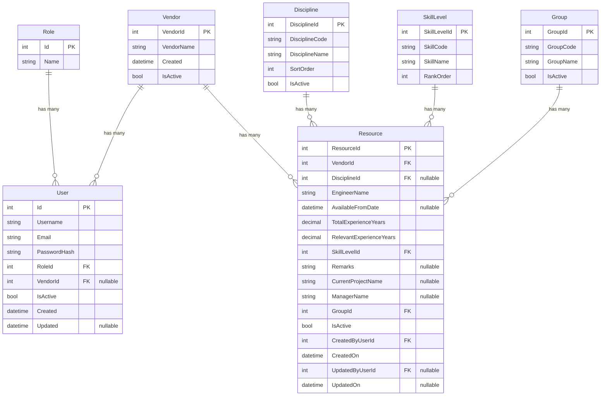

# Vendor Resource Management System — ER Diagram

## Entity Relationship Diagram

## Relationship Summary

| Relationship | Type | Description |
|---|---|---|
| **Role → User** | One-to-Many | Each role can have many users; each user belongs to exactly one role |
| **Vendor → User** | One-to-Many (Optional) | A vendor can have many users; a user may optionally belong to a vendor |
| **Vendor → Resource** | One-to-Many | A vendor can have many resources; each resource belongs to exactly one vendor |
| **Discipline → Resource** | One-to-Many (Optional) | A discipline can have many resources; a resource may optionally belong to a discipline |
| **SkillLevel → Resource** | One-to-Many | A skill level can be assigned to many resources; each resource has exactly one skill level |
| **Group → Resource** | One-to-Many | A group can contain many resources; each resource belongs to exactly one group |

## Table Details

### Role
The lookup table for access control. Contains values like `admin` and `vendor`.

### Vendor
Companies/contractors that provide engineering resources. Linked to both users (for login/access) and resources (for ownership).

### User
System users who authenticate via JWT. Each user has a role and optionally belongs to a vendor (vendor-type users).

### Resource *(Central Entity)*
The core business entity — an engineer/contractor resource. Links to:
- **Vendor** — which company provides them
- **Discipline** — their engineering discipline (optional)
- **SkillLevel** — their proficiency rating
- **Group** — organizational grouping
- **User** (via `CreatedByUserId` / `UpdatedByUserId`) — audit trail

### Discipline
Engineering disciplines (e.g., Mechanical, Electrical, Civil). Used for categorization and headcount reporting.

### SkillLevel
Proficiency levels with a rank order for sorting (e.g., Junior, Mid, Senior, Lead).

### Group
Organizational groups/departments for resource categorization.
